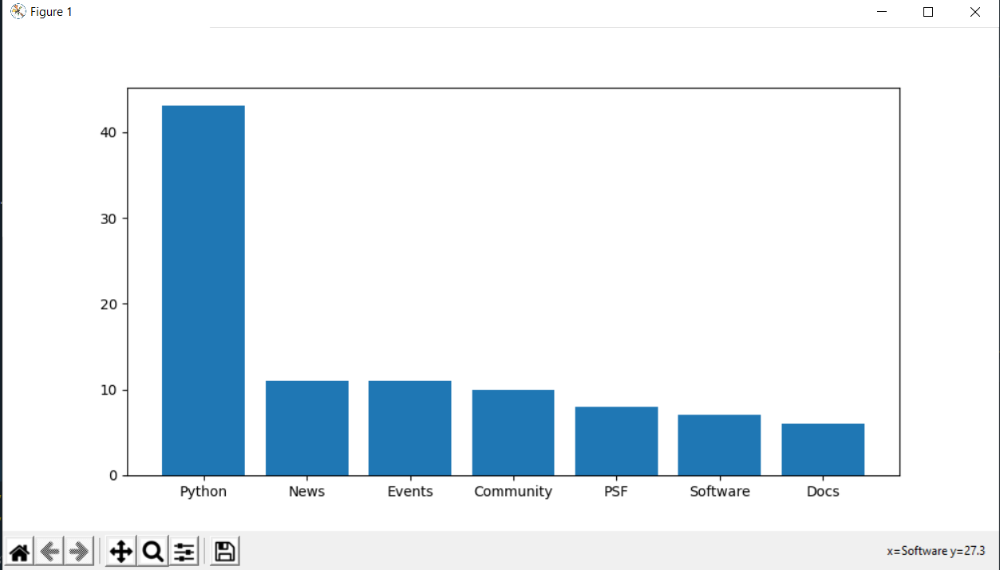

# Modules, Web Scrapping, Data Analysis & TDD

Technologies Used;

- Requests module
- Beautiful Soup library
- Matplotlib library
- Test-Driven Development
- Object Oriented Programming

## Conventions / Coding Styles

1. Notice that names of modules, methods, functions and variables are `snake_cased`, while names of classes are `PascalCased`
2. two spaces exactly between import and actual codes in modules
3. consistency with the usage of string quotes. Always use the single quote except in situations where you need to use double quotes

## Github Convention followed

1. Created a branch named `implement-web-analysis` and only worked within this branch
2. Completed implementation and testing of the web analysis
3. When done,  changes were pushed and  pull request was raised on Github using the pull request template already added to the project (`.github` folder)

## Approach

- Tried to not attempt to conceptualize the whole documentation and codebase at once, instead i moved step by step through the task
- I understood the problem before attempting to write any code
- I wrrote the expected unit tests first before actual implementation, as that confirms that I conformed to the `TDD Methodology`.
- I made sure to manually experiment within the modules to confirm the results of your implementations

## Running Your Tests

```bash
Machine>> cd <this-project-folder>

Machine>> python -m unittest tests
```

## Website Analysis

The goal for this project is to create a script that will accept a web site to scrape and display the top words used within the site. We’ll plot the results within a nicely formatted pie and bar plot, making it easier to understand for those looking at the data.

## Task Analysis and Design

We need to lay out a design of what the final program should look
like, as well as how it should function. For testing purposes, we’ll use Python’s home page. Eventually, we’ll want the final output to look like...

## Pie Plot


## Bar Plot



## Step by step Analysis

- We’re going to make the program continually ask the users if they’d like to scrape a web site <br/>
- Accept the users’ input for the site they’d like to analyze.
- After that, we can filter out all information that isn’t useful like
  - All non-text elements, such as scripts, comments, etc.
  - All common article words and useless characters like newlines characters, empty spaces and tabs
    - *check utils module for list of common words and feel free to add to it*
- Finally,
  - 1. Create a bar plot.
  - 2. Create a pie plot

The program output looks like the following:

```bash

>>> Would you like to scrape a website (y/n)? y
>>> Enter a website to analyze: https://www.python.org
>>> The top word is: python
>>> *** show bar plot ***
>>> Would you like to scrape a website (y/n)? n
>>> Thanks for analyzing! Come back again!

```

****

**NOTE:** **Your implementation for this mini project deployed the usage OOP (Object Oriented Programming Paradigm) and conform to SOLID principle**

## How to use this app
-clone this code from repository
-create virtual environment with this command 'python -m venv'
-activate virtual environment 'source venv/bin/activate'
-install dependencies(requirements) using this command 'pip install -r requirements.txt'
-run the app 'python main.py' our click the play button on vs code

## screen shots on how it runs


## screen shots of result


**Happy Using...**


